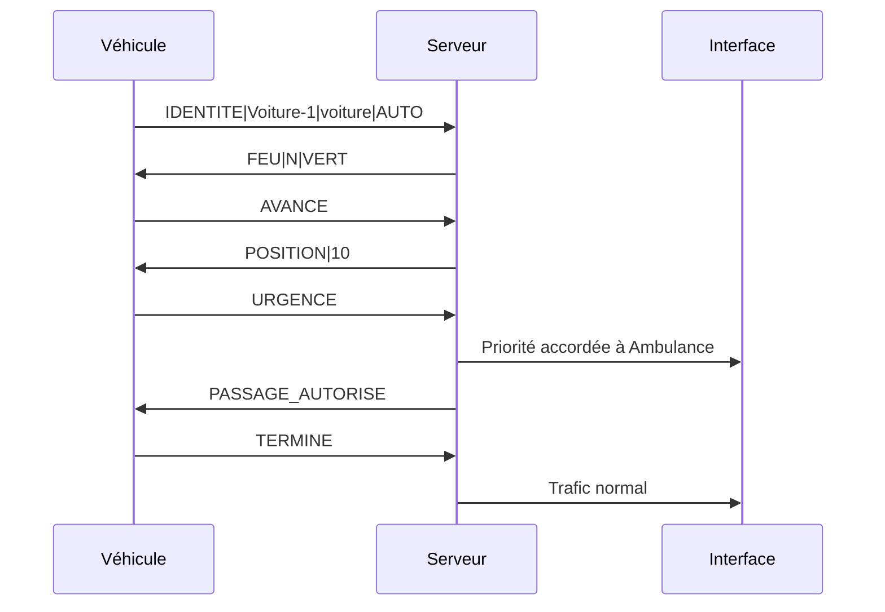

# Carrefour intelligent

Projet réalisé dans le cadre de la SAE 3.02 : Développer des applications communicantes.

## 1. Présentation du projet

Ce projet simule un carrefour intelligent et connecté dans lequel des véhicules communiquent avec un serveur central afin de gérer la circulation et de sécuriser le passage des véhicules prioritaires.

L’objectif principal est de mettre en place un système de gestion dynamique des feux de circulation avec :

- une circulation normale contrôlée par le serveur,
- une prise en charge des véhicules prioritaires,
- une logique d’attente et de sécurité pour éviter les collisions,
- une interface visuelle pour observer les états du carrefour.

La communication entre le serveur et les clients est réalisée via des sockets TCP en Python, avec gestion multithreadée.

---

## 2. Objectifs fonctionnels

Le système doit permettre de :

- faire apparaître des voitures normales à intervalles variables,
- gérer l’état des feux de circulation selon un cycle temporel,
- détecter et traiter une demande de priorité d’un véhicule urgent,
- autoriser le passage d’un véhicule prioritaire pendant un court instant,
- empêcher les mouvements dangereux dans le carrefour,
- afficher en temps réel l’état du carrefour dans une interface graphique.

---

## 3. Contexte technique

Le projet est entièrement développé en Python et s’appuie sur :

- Python 3.x
- PySide6 pour l’interface utilisateur
- sockets TCP pour la communication réseau
- threading pour la concurrence
- QTimer pour le cycle des feux

Les exigences de la SAE sont respectées dans une logique de simulation locale sur un seul poste. Le serveur agit comme un contrôleur central qui reçoit les demandes des véhicules et décide des états des feux.

---

## 4. Architecture globale

Le système est organisé selon un schéma client-serveur :

- le serveur gère l’état global du carrefour,
- chaque voiture ou véhicule prioritaire est un client TCP,
- le carrefour est affiché via une interface graphique,
- les messages échangés circulent sous forme de commandes textuelles.

### 4.1 Composants principaux

- Serveur de contrôle : [carrefour.py](carrefour.py)
- Client voiture standard : [voiture.py](voiture.py)
- Client véhicule prioritaire : [urgence.py](urgence.py)
- Script d’automatisation : [lancer_simulation.sh](lancer_simulation.sh)
- Dépendances : [requirements.txt](requirements.txt)

### 4.2 Rôle de chaque composant

#### Serveur central

Le fichier [carrefour.py](carrefour.py) contient :

- la classe EtatCarrefour,
- la logique de gestion des feux,
- la logique de calcul de progression des véhicules,
- la gestion des connexions clients,
- la fenêtre Qt affichant le carrefour et l’état de la simulation.

Le serveur écoute sur l’adresse locale 127.0.0.1 et le port 5000.

#### Véhicules standards

Le fichier [voiture.py](voiture.py) simule des véhicules classiques qui :

- se connectent au serveur,
- s’identifient avec un nom unique,
- demandent l’autorisation d’avancer,
- attendent si le feu est rouge ou orange,
- traversent progressivement jusqu’à atteindre 100 %.

#### Véhicule prioritaire

Le fichier [urgence.py](urgence.py) simule un véhicule prioritaire, par exemple une ambulance, qui :

- s’identifie avec un nom et une direction,
- envoie une demande spéciale de priorité,
- reçoit le signal de passage autorisé,
- franchit le carrefour en priorité.

---

## 5. Fonctionnement de la simulation

### 5.1 Cycles des feux

La logique du carrefour suit un cycle de deux directions principales :

- Nord-Sud : vert pendant une phase,
- puis orange,
- puis Est-Ouest : vert,
- puis orange,
- puis retour à Nord-Sud.

Les phases sont gérées dans le serveur par le timer de la fenêtre. Si un véhicule prioritaire demande la priorité, le cycle normal est interrompu et les feux sont basculés selon la direction du véhicule urgent.

### 5.2 Gestion des véhicules normaux

Chaque voiture normale :

- prend une direction aléatoire si elle n’en a pas déjà reçu une,
- progresse dans la file jusqu’à la ligne d’arrêt,
- s’arrête si le feu est rouge ou orange,
- avance si le feu est vert,
- respecte les distances de sécurité avec les autres véhicules de la même direction,
- ne peut pas entrer dans le carrefour si une voie perpendiculaire est déjà occupée.

### 5.3 Gestion des urgences

Quand un véhicule prioritaire envoie la commande URGENCE :

1. le serveur le marque comme prioritaire,
2. les feux sont forcés en faveur de sa direction,
3. le serveur répond PASSAGE_AUTORISE,
4. le véhicule traverse le carrefour,
5. lorsque le véhicule envoie TERMINE, le cycle revient au mode normal.

---

## 6. Protocoles de communication

Les messages sont envoyés en texte avec une structure de type :

- IDENTITE|nom|type|direction
- ETAT
- AVANCE
- URGENCE
- TERMINE

### 6.1 Exemple de flux



### 6.2 Réponses serveur

Le serveur répond selon les situations :

- POSITION|pourcentage pour une progression normale,
- ATTENTE|pourcentage si le véhicule doit attendre,
- FEU|direction|couleur pour confirmer l’état des feux,
- PASSAGE_AUTORISE pour un véhicule prioritaire,
- TERMINE pour clôturer le passage.

---

## 7. Structure du dépôt

- [README.md](README.md) : documentation principale du projet
- [DOCUMENTATION.md](DOCUMENTATION.md) : documentation détaillée technique
- [carrefour.py](carrefour.py) : serveur TCP + interface graphique
- [voiture.py](voiture.py) : génération de véhicules standards
- [urgence.py](urgence.py) : véhicule prioritaire
- [lancer_simulation.sh](lancer_simulation.sh) : script d’exécution automatisée
- [requirements.txt](requirements.txt) : dépendances Python
- [Stack_Technique.md](Stack_Technique.md) : contraintes techniques de la SAE
- [LICENSE](LICENSE) : licence du projet

---

## 8. Prérequis

Avant de lancer le projet, il faut disposer de :

- Python 3.10 ou supérieur
- pip pour installer les dépendances
- un environnement virtuel recommandé

---

## 9. Installation

### 9.1 Cloner le dépôt

```bash
git clone <URL_DU_REPOSITORY>
cd SAE302
```

### 9.2 Créer et activer un environnement virtuel

Linux/macOS :

```bash
python3 -m venv .venv
source .venv/bin/activate
```

Windows :

```bash
python -m venv .venv
.venv\Scripts\activate
```

### 9.3 Installer les dépendances

```bash
pip install -r requirements.txt
```

---

## 10. Lancement manuel

Ouvrir au moins trois terminaux distincts.

### 10.1 Démarrer le serveur

```bash
python carrefour.py
```

### 10.2 Démarrer les voitures normales

```bash
python voiture.py 3
```

Le paramètre 3 correspond à la densité de circulation. Plus cette valeur est élevée, plus les voitures sont générées rapidement.

### 10.3 Démarrer un véhicule prioritaire

```bash
python urgence.py Ambulance N
```

Le premier argument est le nom du véhicule, le second la direction : N, S, E ou O.

---

## 11. Lancement automatisé

Un script est fourni pour lancer la simulation entière :

```bash
chmod +x lancer_simulation.sh
./lancer_simulation.sh 3
```

Le script :

- démarre le serveur,
- lance la génération de voitures,
- attend quelques secondes,
- démarre un véhicule prioritaire,
- s’arrête proprement lors d’un Ctrl+C.

---

## 12. Utilisation et observation

La fenêtre du carrefour affiche :

- les feux de chaque direction,
- les véhicules présents,
- leur progression dans le carrefour,
- leur priorité éventuelle,
- l’état du trafic global.

Dans le terminal du serveur, il est possible de suivre :

- les connexions entrantes,
- les demandes de priorité,
- les changements de phase,
- les messages de circulation.

---

## 13. Sécurité et logique de collision

La simulation intègre plusieurs mesures de sécurité :

- blocage de l’entrée d’une route si une voie perpendiculaire est déjà occupée,
- respect de la ligne d’arrêt avant d’entrer dans le carrefour,
- attente au feu rouge ou orange,
- priorité à droite appliquée dans certains cas,
- gestion de la distance avec les véhicules précédents.

Cela permet d’éviter les situations dangereuses et d’offrir un comportement réaliste.

---

## 14. Limites connues

Le système est une simulation locale et pédagogique. Il ne couvre pas tous les cas de trafic du monde réel. Parmi les limites :

- les véhicules sont générés de façon simple et sans vraie planification routière,
- les directions sont choisies de façon locale et aléatoire,
- la logique de priorité est adaptée à la démonstration, pas à un environnement industriel,
- il n’y a pas de persistance des données ou d’historique détaillé.

---

## 15. Améliorations possibles

Le projet peut être enrichi avec :

- un historique des événements dans une base de donnée SQLite,
- des statistiques de trafic en temps réel,
- des graphes de performance et de temps d’attente,
- un système de règles plus avancé pour les feux et la priorité,
- une gestion plus fine des routes et des intersections multi-voies,
- une interface plus ergonomique et configurable.

---

## 16. Licence

Ce projet est distribué sous la licence ouverte indiquée dans le fichier [LICENSE](LICENSE).

---

## 17. Conclusion

Le projet constitue une démonstration complète d’un carrefour intelligent avec communication réseau et gestion dynamique des feux. Il permet de comprendre les bases de la programmation concurrente, de la communication TCP, de l’interface graphique Qt et de la logique de contrôle d’un système embarqué de mobilité intelligente.
